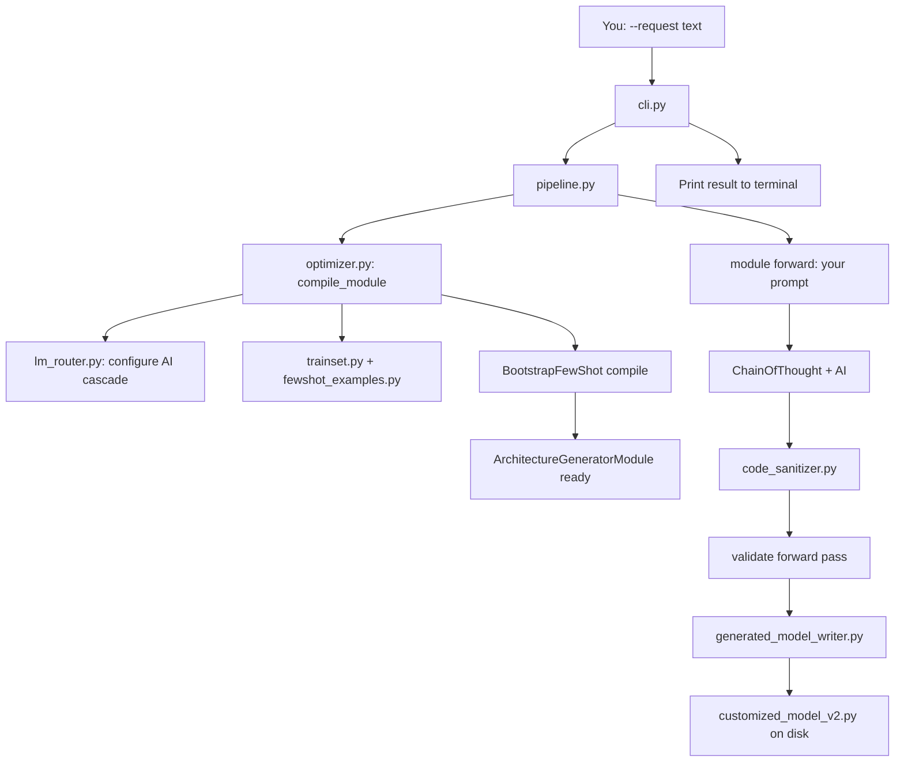

# Workflow Explanation — `tools/model_plugin_dspy_v2`

This document explains **what happens inside the computer** when you run the model plugin tool.  
Read `Run_Example.md` if you only need copy-paste commands.

---

## Big picture (one sentence)

You type a **layer list in English** → DSPy asks an **AI** to write **PyTorch code** → the tool **checks** the code → it **saves** one Python file under `plugins/models/generated_architecture/`.

This tool runs **on your PC during development**. It is **not** part of the FeatureCloud federated training loop at runtime.

---

## How execution starts

### Entry point

Everything begins when you run:

```powershell
python -m tools.model_plugin_dspy_v2.cli --request "..."
```

| Step | What happens |
|------|----------------|
| 1 | Python loads the package `tools.model_plugin_dspy_v2`. |
| 2 | `cli.py` → function `main()` runs. |
| 3 | `main()` reads your text from `--request` (or `--prompt`). |
| 4 | `main()` finds the **repo root** (two folders above `cli.py` — where `main.py` and `plugins/` live). |
| 5 | `main()` loads settings from `config.py` → `load_settings()`. |
| 6 | `main()` creates `ModelPluginV2Pipeline` and calls `pipeline.run(your_text)`. |
| 7 | `main()` prints backend name, output path, and the generated code. |

**First file that runs:** `cli.py`  
**Brain of the run:** `pipeline.py`

---

## High-level flow (diagram)



---

## Step-by-step execution (in order)

### Phase A — Setup (before your prompt is generated)

1. **`config.py`**  
   - Holds paths, model names, API keys, bootstrap size.  
   - `load_settings()` builds one `Settings` object used everywhere.

2. **`optimizer.py` → `compile_module()`**  
   This prepares the “AI brain” **once per run**:

   | Sub-step | File | What it does |
   |----------|------|----------------|
   A.1 | `lm_router.py` | Builds **Groq → Gemini → Cohere → Mistral → Ollama** list. Wraps them in `LiteLLMCascadeLM`. Calls `dspy.configure(lm=cascade)` so **all** DSPy calls use this router. |
   A.2 | `fewshot_examples.py` | Static list `FEWSHOT_PAIRS`: many `(description, gold_python_code)` pairs. **Data only** — not executed as code. |
   A.3 | `trainset.py` | Converts each pair into `dspy.Example(architecture_description=..., architecture_code=...)`. |
   A.4 | `architecture_generator.py` | Creates raw `ArchitectureGeneratorModule` (contains `ChainOfThought` predictor). |
   A.5 | `metric.py` | `architecture_metric` — scores AI output 0.0 or 1.0 (valid PyTorch plugin or not). |
   A.6 | DSPy `BootstrapFewShot` | Runs **many extra AI calls** on the trainset. Picks good demos. Returns a **compiled** module (smarter than the raw one). |

   **Important:** Bootstrap runs **in memory**. It does **not** write files. It can take 1–3 minutes and costs API usage.

3. **Result of Phase A:** a compiled `ArchitectureGeneratorModule` ready to accept **your** `architecture_description`.

---

### Phase B — Generate code for your request

4. **`pipeline.py` → `run()`** calls:

   ```python
   result = module(architecture_description=request)
   ```

   That calls **`ArchitectureGeneratorModule.forward()`** in `architecture_generator.py`.

5. **Inside `forward()` (up to 3 tries):**

   | Step | What happens |
   |------|----------------|
   B.1 | `dspy.ChainOfThought(GenerateArchitectureSignature)` sends your text to the AI. |
   B.2 | AI returns `architecture_code` (often with markdown fences). |
   B.3 | `code_sanitizer.py` → `extract_python_code()` strips ``` blocks and keeps real Python. |
   B.4 | Read `dspy.settings.lm` → `last_backend`, `last_model`, `last_base_url` (which provider won in the cascade). |
   B.5 | Pack into `ArchitectureResult` (`types.py`): `code`, `backend`, `model`, `base_url`. |
   B.6 | `_validate_forward_pass()` — `exec()` the code, build `Model(n_classes=10, in_features=...)`, run one forward pass with dummy tensors. |
   B.7 | If validation fails and retries remain → append error text to prompt and ask AI again. |

6. **`pipeline.py`** receives `ArchitectureResult` with final Python source.

---

### Phase C — Write to disk

7. **`generated_model_writer.py`**

   | Step | File | What happens |
   |------|------|----------------|
   C.1 | `generation_header.py` | Builds comment header (tool name, provider, model name). |
   C.2 | `model_file_writer.py` | Writes UTF-8 text to disk, creates folders if needed. |
   C.3 | Output path from `config.py` | `plugins/models/generated_architecture/customized_model_v2.py` |

8. **`pipeline.py`** returns a dictionary to `cli.py` (`backend`, `output_model`, `architecture`, …).

9. **`cli.py`** prints lines for you to read.

---

## How data moves through the system

Think of **four kinds of data**:

| Kind | Starts as | Becomes | Ends as |
|------|-----------|---------|---------|
| **Your input** | String in `--request` | `architecture_description` in DSPy | Used in prompts to AI |
| **Training data** | `FEWSHOT_PAIRS` in `fewshot_examples.py` | `dspy.Example` list in `trainset.py` | Few-shot demos inside compiled module (in RAM) |
| **AI output** | Raw text from LM | Cleaned Python via `code_sanitizer.py` | `ArchitectureResult.code` |
| **File output** | `ArchitectureResult` + header | One `.py` file | `customized_model_v2.py` |

**Data does NOT flow into:**

- `config.yml` (that is another tool: `tools/dspy` or `tools/config_plugin_dspy`)
- FeatureCloud Docker containers (unless **you** copy the file and point config at it later)
- Databases or network training — only HTTP calls to AI providers

---

## DSPy-related logic (simple explanation)

**DSPy** is a library that helps you call language models in a structured way.

### Pieces used in this project

| DSPy concept | Where in this folder | Role |
|--------------|----------------------|------|
| `dspy.Signature` | `architecture_generator.py` → `GenerateArchitectureSignature` | Defines **inputs** (`architecture_description`) and **outputs** (`architecture_code`). |
| `dspy.Module` | `ArchitectureGeneratorModule` | Your custom class; `forward()` is what `pipeline` calls. |
| `dspy.ChainOfThought` | Inside the module | Asks the LM to “think” then produce the code field. |
| `dspy.Example` | `trainset.py` | One training row: description + gold code. |
| `dspy.BootstrapFewShot` | `optimizer.py` | Picks and compiles best few-shot demos using `architecture_metric`. |
| `dspy.configure(lm=...)` | `lm_router.py` | Sets the global LM to the cascade wrapper. |
| `dspy.LM` | `lm_router.py` | LiteLLM-backed connection to Groq, Gemini, etc. |

### Two different “checks” on generated code

Do not confuse them — both exist on purpose:

| Check | Where | When | Purpose |
|-------|-------|------|---------|
| **`architecture_metric`** | `metric.py` | During **BootstrapFewShot** (training compile) | Score 0/1 so DSPy keeps only good demos. |
| **`_validate_forward_pass`** | `architecture_generator.py` | During **your** run, after each AI answer | Retry up to 3 times if code does not run. |

They use similar ideas (syntax, CNN vs MLP, forward pass) but run at **different stages**.

### Language model cascade

`LiteLLMCascadeLM.forward()`:

1. Try Groq.  
2. If error → try Gemini.  
3. If error → try Cohere.  
4. If error → try Mistral.  
5. If error → try Ollama (local).  
6. If all fail → raise error.

On success it stores which backend won → used in the file header and terminal output.

---

## All files and responsibilities

| File | Responsibility |
|------|----------------|
| `cli.py` | Command-line entry; parse args; call pipeline; print results. |
| `pipeline.py` | Orchestrator: compile module → generate → write file → return dict. |
| `config.py` | Constants, `Settings`, Ollama URL/model resolution, output paths. |
| `optimizer.py` | Wire LM + trainset + metric + BootstrapFewShot → compiled module. |
| `lm_router.py` | Multi-provider LM cascade; `dspy.configure`. |
| `dspy_support.py` | Single place to `import dspy` (clear error if missing). |
| `fewshot_examples.py` | **Data:** prompt/code pairs (layer-list style). |
| `trainset.py` | Convert pairs → `dspy.Example` objects. |
| `metric.py` | Bootstrap metric: is generated code a valid plugin? |
| `architecture_generator.py` | Signature, Module, ChainOfThought, retries, forward-pass test. |
| `code_sanitizer.py` | Remove markdown fences; extract Python from LM text. |
| `types.py` | `ArchitectureResult` dataclass. |
| `generated_model_writer.py` | Combine header + code; choose output path. |
| `generation_header.py` | Comment block at top of generated file. |
| `model_file_writer.py` | Low-level `write_text` to disk. |
| `__init__.py` | Exports `ModelPluginV2Pipeline` for imports. |
| `Run_Example.md` | How to run (user guide). |
| `Workflow_Explanation.md` | This file — how it works inside. |

---

## How components interact (who calls whom)

```
cli.py
  └── pipeline.py
        ├── config.load_settings / resolve_ollama_*
        ├── optimizer.compile_module()
        │     ├── lm_router.configure_dspy_cascade()
        │     ├── trainset.build_trainset()  ← fewshot_examples.FEWSHOT_PAIRS
        │     ├── ArchitectureGeneratorModule  (architecture_generator.py)
        │     └── BootstrapFewShot(metric=architecture_metric)
        ├── module(architecture_description)  → architecture_generator.forward()
        │     ├── ChainOfThought → dspy.settings.lm (lm_router cascade)
        │     ├── code_sanitizer.extract_python_code()
        │     └── _validate_forward_pass()
        └── generated_model_writer.write()
              ├── generation_header.build_generation_header()
              └── model_file_writer.write_model_file()
```

---

## What happens after the file is written?

This package **stops** after saving `customized_model_v2.py`.

To use the model in FeatureCloud you must **separately**:

1. Reference the plugin in your `config.yml` (e.g. `fc_deep.model.name` pointing at the generated file or a copy you rename).  
2. Build the Docker image and run `featurecloud test start` (see project `Run_App.md`).

That training path uses `utils/pytorch/`, `plugins/models/`, etc. — **outside** `tools/model_plugin_dspy_v2`.

---

## Typical timeline of one run

| Time | What you see / what runs |
|------|---------------------------|
| 0 s | `cli.py` starts |
| 1–120 s | `BootstrapFewShot` — many LM calls on few-shot examples (slowest part) |
| 5–30 s | One (or more) LM call for **your** prompt; maybe retries |
| &lt; 1 s | Sanitize code, validate forward pass, write file |
| End | Terminal shows backend + path + full source |

---

## Mental model (remember this)

1. **`fewshot_examples.py`** = textbook examples the AI studies during compile.  
2. **`optimizer.py`** = teacher that prepares the AI using those examples.  
3. **`architecture_generator.py`** = worker that writes code for **your** homework question.  
4. **`generated_model_writer.py`** = saves the homework to disk.  
5. **`cli.py`** = door you knock on to start everything.

---

## Related docs

- **`Run_Example.md`** — environment setup and two layer-list examples.  
- **`fewshot_examples.py`** — full list of training prompts and gold code.  
- **Project `Run_App.md`** — running FeatureCloud app (federated / simulation / centralized), not this DSPy tool.
