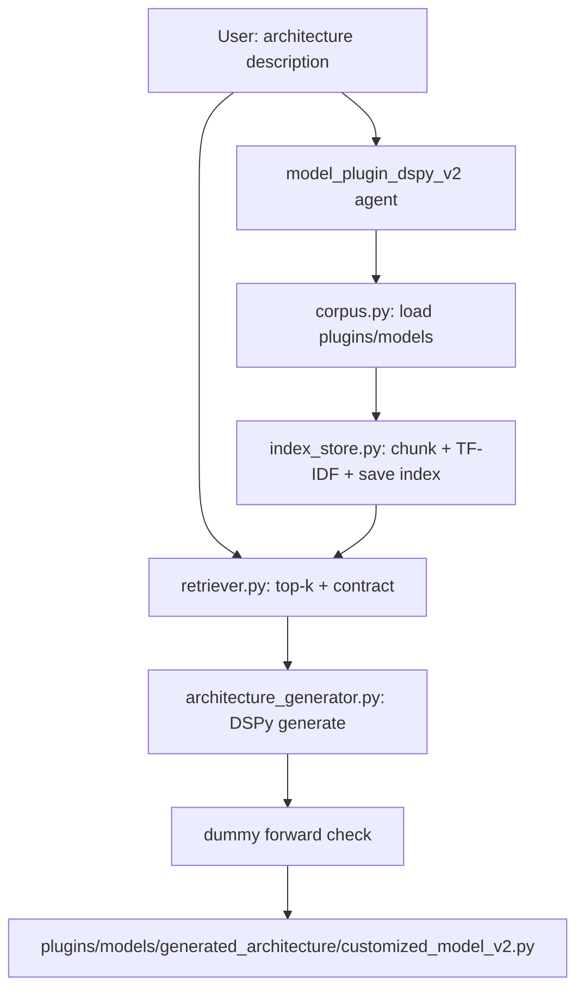

# Local RAG in `model_plugin_dspy_v2`

---

## 1. What this is RAG, and which agent it belongs to:

**RAG** = **R**etrieval-**A**ugmented **G**eneration.

Think of an **open-book test**. The language model is the student. RAG lets it **open the book** (your plugin files) before it writes, instead of guessing from memory only.

| Letter | Word           | Role                                                                                                                             |
| ------ | -------------- | -------------------------------------------------------------------------------------------------------------------------------- |
| **R**  | **Retrieval**  | Search a knowledge base for pages that match the user’s question. Here that base is `plugins/models/*.py` (indexed plugin code). |
| **A**  | **Augmented**  | Put those pages into the prompt next to the user’s text. The model sees the question **plus** the retrieved code.                |
| **G**  | **Generation** | The LLM writes the new answer (a `class Model`) using both its training and those retrieved pages.                               |

This folder (`tools/model_plugin_dspy_v2/rag/`) is used only by the **model plugin v2 agent** (`tools/model_plugin_dspy_v2`).

---

## 2. Why we use RAG here:

1. New saved plugins are picked up after the index rebuilds. You do not retrain the LLM.
2. If the user says “like `cnn.py`” or “like `c_f_test1.py`” which was already created by another user, retrieval can **open that file** instead of guessing.
3. Few-shots only show a **few** examples. They cannot list every plugin on disk (`cnn.py`, `mlp.py`, saved files like `c_f_test1.py`).
4. The LLM was not trained on **this** repo. Without RAG it may invent a wrong constructor.
5. Every generated plugin must share the same **constant rules** (the **contract**). Those rules never change with the user’s question: class name `Model`, `__init__(self, n_classes, in_features)`, and `forward`. Retrieved files are **examples** that already follow the contract; the contract itself is always prepended (`plugin_contract.md`).

(The scratch file `generated_architecture/customized_model_v2.py` is not indexed; it is this run’s output, not a teacher.)

---

## 3. Sequence (how the files run)

| Order | File                        | Job                                                                                                                                                                                                            |
| ----- | --------------------------- | -------------------------------------------------------------------------------------------------------------------------------------------------------------------------------------------------------------- |
| 1     | `corpus.py`                 | Load `plugins/models/**/*.py`. Skip `generated_architecture/`.                                                                                                                                                 |
| 2     | `chunking.py`               | One file ≈ one chunk (split only if the file is huge).                                                                                                                                                         |
| 3     | `embedder.py`               | Local TF-IDF vectors (no cloud embedding API).                                                                                                                                                                 |
| 4     | `index_store.py`            | Save `rag_index/index.json`. Rebuild only when plugin files change (fingerprint).                                                                                                                              |
| 5     | `retriever.py`              | Search top-k plugin files (they **change** per question). Always add the **contract** first (`plugin_contract.md`) — the **constant** rules every output must follow. If `rag_enabled=False`, return **only** the contract. |
| 6     | `architecture_generator.py` | Retrieve **once** per request; retries reuse the same pages. Then generate code, check a dummy `forward()`, write `customized_model_v2.py`.                                                                    |

---

## 4. Big picture

**Key takeaway:** Index plugins → retrieve top-k → inject into this agent’s prompt → write `customized_model_v2.py`.

---

**NOTE — why there is no vector database:** RAG needs **vectors + search**, not a product named “vector database.” Those databases (Pinecone, Chroma, FAISS, …) help when you have **thousands** of chunks and need fast nearest-neighbor search. Here the knowledge base is a **small** `plugins/models/` folder. We store TF-IDF vectors in `rag_index/index.json` and compare the question to every chunk in Python. That is enough, with no extra server or install.